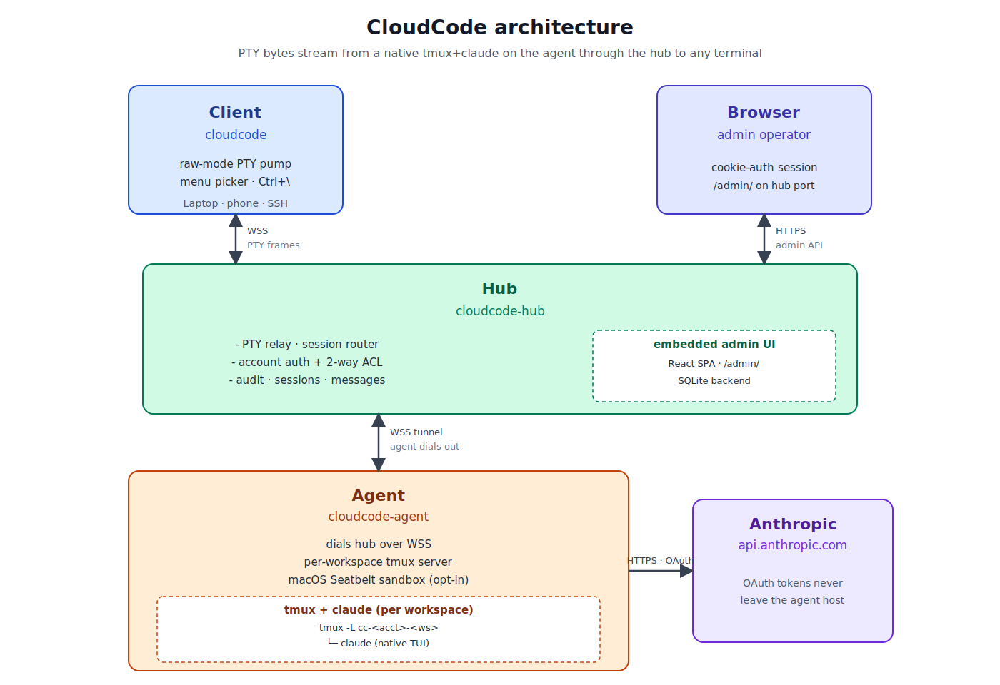

# cloudcode

> 自托管 LLM 网关：集中管理凭据，团队透明使用 Claude Code，每次请求留审计。

## 组件

- **`cloudcode-hub`** —— 中转层，做账号鉴权、ACL、JSONL 审计
- **`cloudcode-agent`** —— 部署在已 `claude /login` 的机器，按订阅凭据转发请求（也可直连 API key）
- **`cloudcode`** —— 客户端 launcher，开发者本地启动 claude

## 架构



源文件见 [`docs/architecture.drawio`](docs/architecture.drawio)（[diagrams.net](https://app.diagrams.net) 可编辑）。

## 安装

```bash
# 远端
curl -fsSL https://raw.githubusercontent.com/initialz/cloudcode/main/install.sh | sh -s -- hub
curl -fsSL https://raw.githubusercontent.com/initialz/cloudcode/main/install.sh | sh -s -- agent

# 本地
curl -fsSL https://raw.githubusercontent.com/initialz/cloudcode/main/install.sh | sh -s -- client
```

支持 Linux x86_64/aarch64、macOS aarch64。

## 使用

### Agent（一次性设置）

在一台已 `claude /login` 过的机器：

```bash
cloudcode-agent gen-secret               # 生成 hub<->agent 共享密钥
chmod 600 ~/.claude/.credentials.json    # 让 agent 能读
$EDITOR ./agent.toml                     # 粘 shared_secret_hash + credentials_path
cloudcode-agent daemon start --config ./agent.toml
```

### Hub（管理员）

```bash
cloudcode-hub gen-token alice            # 为每个用户生成 token
$EDITOR ./hub.toml                       # 加 [[agents]] 与 [[accounts]]
cloudcode-hub daemon start --config ./hub.toml
```

> Daemon 日志在 `~/.local/state/cloudcode/{hub,agent}.log`，`cloudcode-hub|cloudcode-agent daemon {status,stop,restart}` 管理生命周期。

### Client（开发者）

```toml
# ~/.config/cloudcode/config.toml
hub_url = "https://your-hub-host"
token   = "cc_xxx_from_admin"
```

```bash
cd ~/code/myproj
cloudcode run claude
```

体验和原生 `claude` 一致——所有 API 调用经 hub 鉴权、路由、留审计。

## 配置参考

[`hub.example.toml`](hub.example.toml) · [`agent.example.toml`](agent.example.toml)

> ⚠️ 共享订阅给多人使用违反 Anthropic ToS，建议每位用户绑自己的订阅（一人一个 agent）。

## License

MIT
